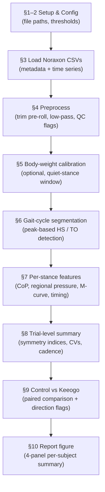

# Keeogo Insole Gait Analysis

End-to-end analysis of a single subject's **Control vs Keeogo** walking trials,
built from Noraxon insole pressure exports. [Keeogo](https://keeogo.com) is a
powered lower-limb exoskeleton; the question this pipeline answers is whether
wearing it moves a subject's gait metrics in the expected (healthier) direction
compared to unassisted walking.

The entire pipeline lives in one notebook — [`Keeogo_Insole_Analysis.ipynb`](Keeogo_Insole_Analysis.ipynb) —
which loads two trials, segments gait cycles, extracts per-stance features, and
produces a side-by-side comparison plus a one-page report figure.

## Overview

- **Insole signals only.** Center of pressure (CoP), regional pressure (%), Total %
  as a ground-reaction-force surrogate, and temporal–spatial parameters. EMG and
  kinematics are intentionally excluded.
- **Within-subject design.** One subject, two conditions (Control and Keeogo),
  walking free-speed on a treadmill. Metrics are compared as paired differences
  (Keeogo − Control) with effect-direction flags.
- **One subject today, a cohort tomorrow.** The pipeline is written to run
  unchanged on any subject pair — swap the two CSV paths and re-run.

## Repository contents

| File | Description |
|------|-------------|
| [`Keeogo_Insole_Analysis.ipynb`](Keeogo_Insole_Analysis.ipynb) | The full analysis pipeline (sections 1–10). |
| `2025-07-11-16-20_control_FS.csv` | Control trial — free-speed treadmill walking, no exoskeleton. |
| `2025-07-11-15-57_keeogo_FS01.csv` | Keeogo trial — same subject, wearing the exoskeleton. |
| `Parameters List.xlsx` | Prioritized list of gait parameters; the High-priority ones drive the direction flags in §9. |
| [`myoPRESSURE Report Tutorial - Advanced Definitions.pdf`](myoPRESSURE%20Report%20Tutorial%20-%20Advanced%20Definitions.pdf) | Noraxon reference for metric definitions (e.g. CoP regression angle p.24, gait-line symmetry p.20). |
| `requirements.txt` | Python dependencies. |

## The pipeline



Each notebook section maps to one stage:

1. **Setup** — imports and display options.
2. **Config** — every tunable knob: file paths, sampling rate, filter cutoffs,
   gait-event thresholds, and the `EFFECT_DIRECTION` map (which way each metric
   should move when Keeogo is helping).
3. **Load Noraxon CSVs** — parse the MR 4.0 export into a `Trial` (time series +
   subject metadata + calibration state).
4. **Preprocess** — trim the standing/step-on pre-roll to `t = 0`, zero-phase
   Butterworth low-pass on Total % and CoP, and add QC flag columns (saturation,
   CoP jumps) without dropping samples.
5. **Body-weight calibration** *(optional)* — if a quiet bilateral-stance window
   exists, use it as a 100 % BW reference; otherwise skip silently and report in
   raw Total %.
6. **Gait-cycle segmentation** — peak-based heel-strike / toe-off detection on
   each side's Total % trace (more robust to baseline drift than threshold
   crossing); heel-dominance is reported as QC but not gated by default.
7. **Per-stance feature extraction** — one row per stance: CoP path length / mean
   / range / regression angle, regional peaks / impulses / timing (heel, arch, met,
   hallux), and M-curve features (loading peak, mid trough, push-off peak, loading
   and unloading rates).
8. **Trial-level summary** — roll per-stance rows up to one row per side plus
   bilateral measures (stance-time symmetry index, stride/step-time CVs, cadence,
   lateral and gait-line symmetry, forefoot impulse).
9. **Within-subject comparison** — paired difference, % change, and a direction
   flag (✓ expected / ✗ opposite) for each High-priority metric.
10. **Report figure** — four panels: (a) CoP gait lines per stance, (b) mean
    Total % M-curve, (c) regional peak pressures, (d) headline-metric table.

## Getting started

**Requirements:** Python 3.10+ (the code uses `from __future__ import annotations`
and `np.trapezoid`, which needs **NumPy ≥ 2.0**).

```bash
pip install -r requirements.txt
```

Then launch Jupyter and run the notebook top to bottom:

```bash
jupyter lab   # or: jupyter notebook
```

Open `Keeogo_Insole_Analysis.ipynb` and choose **Kernel → Restart Kernel and Run
All Cells**.

> `jinja2` is used only for the prettily-formatted comparison table in §9; the
> notebook falls back to a plain rounded table if it isn't installed.

## Running on a new subject

1. In **§2 Config**, update `DATA_DIR` to wherever the data lives (it is currently
   a hardcoded absolute path) and point `CONTROL_CSV` / `KEEOGO_CSV` at the new
   trial files.
2. Adjust thresholds only if event detection looks off for that subject.
3. **Restart & Run All.** Everything downstream is path-agnostic.

## Key configuration knobs (§2)

| Setting | Default | What it controls |
|---------|---------|------------------|
| `SAMPLING_RATE_HZ` | `2000` | Acquisition rate (loader overrides from CSV metadata). |
| `COP_LOWPASS_HZ` / `TOTAL_LOWPASS_HZ` | `20` / `25` | Butterworth low-pass cutoffs. |
| `PEAK_MIN_DISTANCE_S` | `0.40` | Cadence floor for peak detection (< 150 steps/min). |
| `PEAK_PROMINENCE_FRAC` | `0.25` | Peak prominence as a fraction of the trace range. |
| `HS_TO_FRACTION` | `0.30` | Total % fraction at which heel-strike / toe-off are marked. |
| `HEEL_DOMINANCE_AT_HS` | `0.00` | Heel-dominance gate (0 = report only, don't reject). |
| `MIN_STANCES` | `5` | Minimum clean stances per side for results to be trusted. |
| `EFFECT_DIRECTION` | *(dict)* | Per-metric "bigger is better" (+1) / "smaller is better" (−1) flags. |

## Outputs

- A **per-stance feature table** per trial (one row per stance).
- A **trial-level summary** (per-side means/SDs plus bilateral metrics).
- A **paired comparison table** (Keeogo − Control, % change, direction flags).
- A **4-panel report figure** summarizing the subject.

## Scope / not implemented

- **EMG** — excluded by design.
- **Static-balance metrics** — need a marked quiet-stance segment in the protocol.
- **Cohort-level statistics** (n ≈ 10) — start once there are ≥ 6 subjects.
- **KAM, KAI, GPS, GVS** — require IMU / kinematic data and body mass.

## Data notes

- **Noraxon export quirks** are handled by the loader: four header rows (metadata
  keys, metadata values, blank, data header) and inconsistent quoting between
  trials. The first two rows are read with the stdlib `csv` module and the rest
  with `pandas`.
- **De-identification:** the CSV metadata header carries subject fields such as
  `last_name`, `sex`, and `measurement_date`. Scrub these before sharing data
  outside the study.
